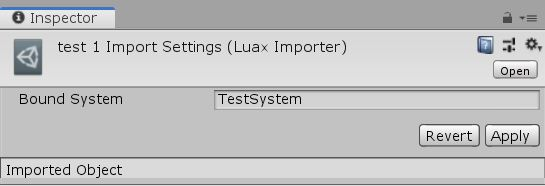

# Unity Component UI

This is an experiment project which aims to create declarative UI system for Unity. It wraps around the built-in unity UI system and adds possibility to integrate it with ECS.

It is heavily inspired by ReactJS.

## Components

This library implements a custom importer that is hooked to every file with `luax` extension. These files are parsed using extended lua syntax.

### Example

```lua
function render()
    return (
        <Panel x={100}>
            <Button />
        </Panel>
    )
end
```

This is transformed to the following `lua` script. Then in order to execute the script this library uses [MoonSharp](https://github.com/moonsharp-devs/moonsharp)

```lua

function render()
    return Create(""Panel"", {
        x = 100,
        children = { Create(""Button"") } 
    })
end
```

## Connecting to system

You can inherit from `ConnectedSystem` class to create a system that is used to retrieve input properties for your component

```csharp
[ConnectedSystemRegistration(nameof(TestSystem))]
public class TestSystem : ConnectedSystem
{
    protected override IDictionary<string, object> GetProps(ref JobHandle inputDeps)
    {
        return new Dictionary<string, object>()
        {
            { "key", "value" },
        };
    }
}
```

Then in the `luax` component importer settings set the name of the system.



from now on the component's input props will change based on what value will be returned from the `TestSystem`.

you can use those props like following:

```lua
function render(props)
    return (
        <Panel>
            <Text text={props.key} />
        </Panel>
    )
end
```

For full example look at the `Example` folder under `Assets`.